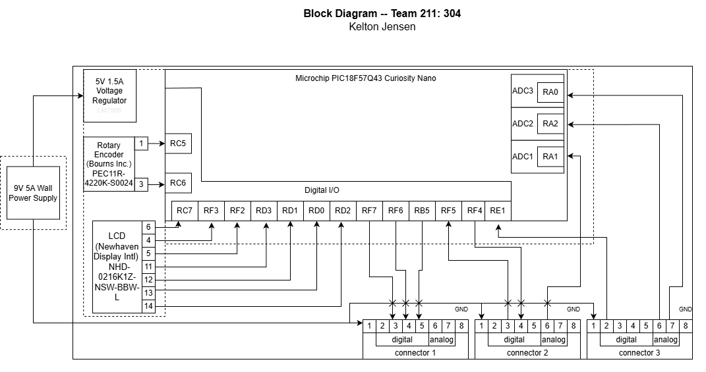

## Overview
The main purpose of this block diagram is to showcase the innerworking of the main hub communicating with the other subsystems. Since we chose the Hub and Spokes setup, this device will be the main hub. Using a LCD display to monitor and display data being transmited, as well as the rotary encoder that will be selecting which data is transmitted to the LCD.

The Wall power supply will also be on my board and will be sending power to all of the other boards through their connector pin 1.

This board can run entirely off of the 5V 1.5A regulated power supply.
## Block Diagram

