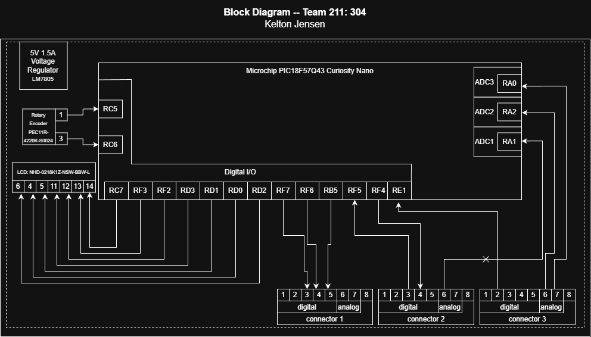

## Overview
The main purpose of this block diagram is to showcase the innerworking of the main hub communicating with the other subsystems. Since we chose the Hub and Spokes setup, this device will be the main hub. Using a LCD display to monitor and display data being transmited, as well as the rotary encoder that will be selecting which data is transmitted to the LCD.

There will be 2 debugging LED's on the main hub, one will be a blue light to note that the system is functioning, the other is located on the LCD display itself and will indicate functionality as well.

This board can run entirely off of the 5V 1.5A regulated power supply
## Block Diagram

