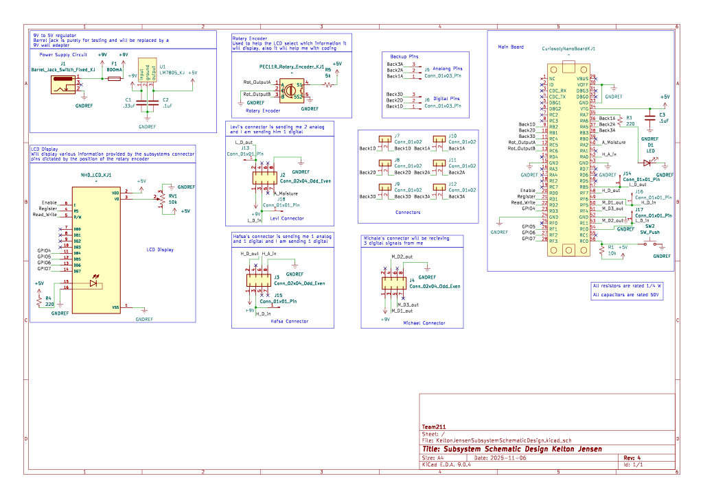

## Overview
This schematic is designed to transmit and recieve data from other teamates subsystems. The schematic also is designed to display information recived as well as display specific information from each board selected by the rotary encoder.

**Figure 1:** Individual PCB Schematic

## Resouces

The schematic as a PDF download is available [*here*](KeltonJensenSubsystemSchematicDesign.pdf), the Zip folder of the custom symbols library [*here*](Custom_Symbol_Library_KJ.zip), the Zip folder of the project [*here*](KeltonJensenSubsystemSchematicDesign.zip), 
