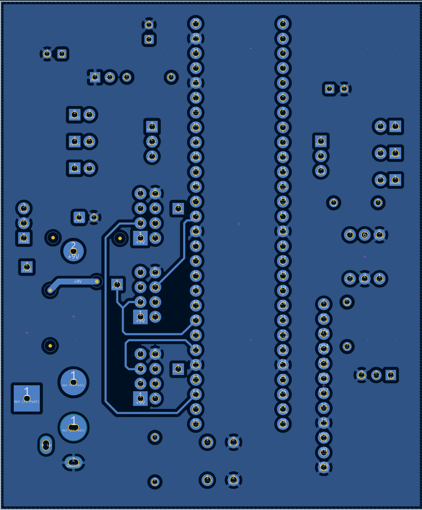

## Overview
The PCB desing contains every component used from the schematic. All components are through hole allowing me to easily connect and disconnect every component. I will be using female to female wires for some of the connections from my teamates to my microcontroller. For the LCD I will be using a ribbon cable so it will not be surface mounted on the PCB itself.

## Physical Skeleton PCB

## Physical Assembled PCB

## KICAD PCB

An easier view of my PCB PDF's are [*here*](PCBFB-combined.pdf) and my custom footprint library is accessible [*here*](myfootprints.pretty.zip)
